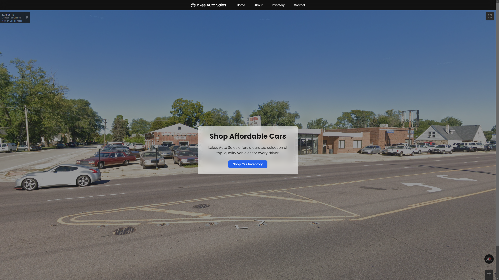

# Lakes Auto Website



This website has been created for the dealership Lakes Auto Sales. The website features a modern design and user-friendly interface to help customers browse and purchase vehicles.

## Key Components

- **React**: A JavaScript library for building user interfaces.
- **Vite**: A build tool that provides a faster and leaner development experience for modern web projects.
- **Tailwind CSS**: A utility-first CSS framework for rapidly building custom user interfaces.
- **Firebase**: Used for hosting and backend services, providing a reliable and scalable infrastructure.

## Features

- **Responsive Design**: Ensures the website looks great on all devices, from desktops to mobile phones.
- **Interactive Map**: Displays the dealership's location using Google Maps.
- **Comprehensive Inventory**: Showcases selection of cars the dealership offer
- **Admin Dashboard (IN DEV.)**: 

## Getting Started

1. Clone the repository:
    ```bash
    git clone https://github.com/yusef800/lakes_auto_vite.git
    ```

## Frontend Deployment

1. Navigate to the Frontend directory:
    ```bash
    cd Frontend
    ``` 

2. Install the dependencies:
    ```bash
    npm install
    ```

3. Start the development server:
    ```bash
    npm run dev
    ```

The site will open on `localhost`.

## Backend Deployment

1. Navigate to the Backend directory:
    ```bash
    cd Backend
    ``` 

2. Start the development server:
    ```bash
    npm run dev
    ```


